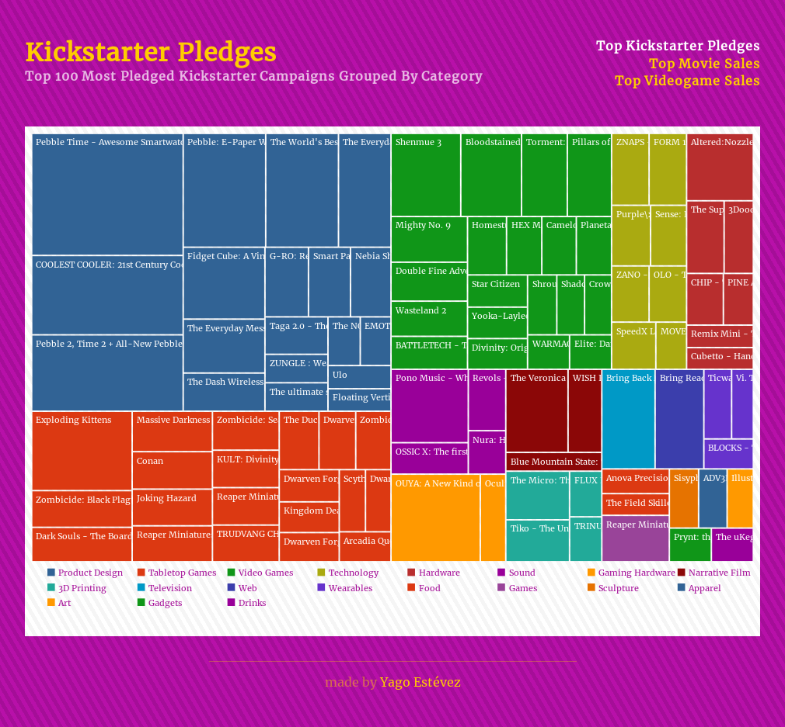

# Visualize Data with a Treemap Diagram
#### Project made for the "Data Visualization" module in freeCodeCamp 



This project was made for the 4th module in freeCodeCamp which requires the camper to code a Treemap Diagram with D3.js representing the following data:
- [Kickstarter Pledges](https://cdn.rawgit.com/freeCodeCamp/testable-projects-fcc/a80ce8f9/src/data/tree_map/kickstarter-funding-data.json).
- [Movie Sales](https://cdn.rawgit.com/freeCodeCamp/testable-projects-fcc/a80ce8f9/src/data/tree_map/movie-data.json).
- [Video Game Sales](https://cdn.rawgit.com/freeCodeCamp/testable-projects-fcc/a80ce8f9/src/data/tree_map/video-game-sales-data.json).

#### User Stories

The project required the following user stories to be fulfilled:

1. My tree map should have a title with a corresponding ```id="title"```.
2. My tree map should have a description with a corresponding ```id="description"```.
3. My tree map should have ```rect``` elements with a corresponding ```class="tile"``` that represent the data.
4. There should be at least 2 different fill colors used for the tiles.
5. Each tile should have the properties ```data-name```, ```data-category```, and ```data-value``` containing their corresponding name, category, and value.
6. The area of each tile should correspond to the data-value amount: tiles with a larger data-value should have a bigger area.
7. My tree map should have a legend with corresponding ```id="legend"```.
8. My legend should have ```rect``` elements with a corresponding ```class="legend-item"```.
9. The ```rect``` elements in the legend should use at least 2 different fill colors.
10. I can mouse over an area and see a tooltip with a corresponding ```id="tooltip"``` which displays more information about the area.
11. My tooltip should have a ```data-value``` property that corresponds to the ```data-value``` of the active area.

---
[Yago Estévez](https://twitter.com/yagoestevez)